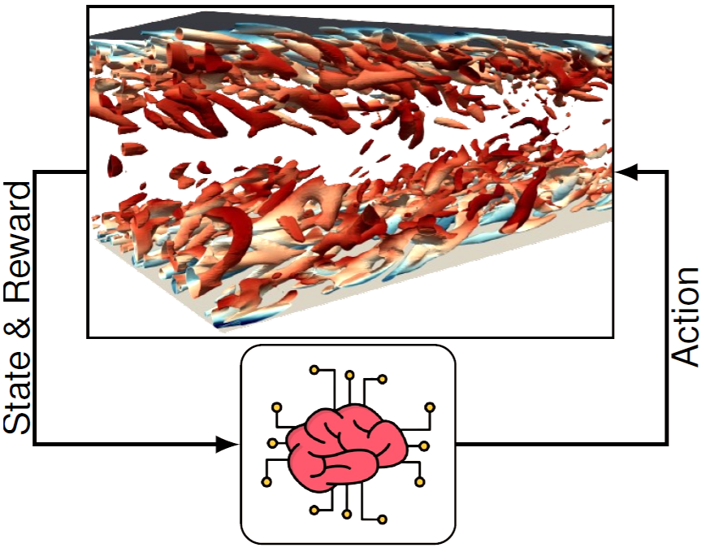
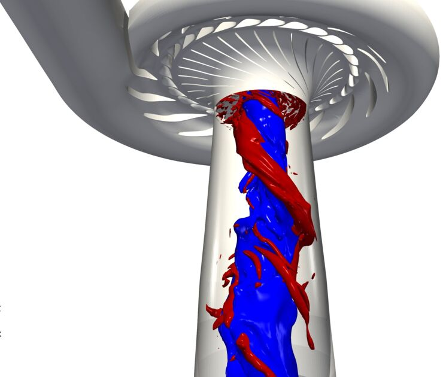
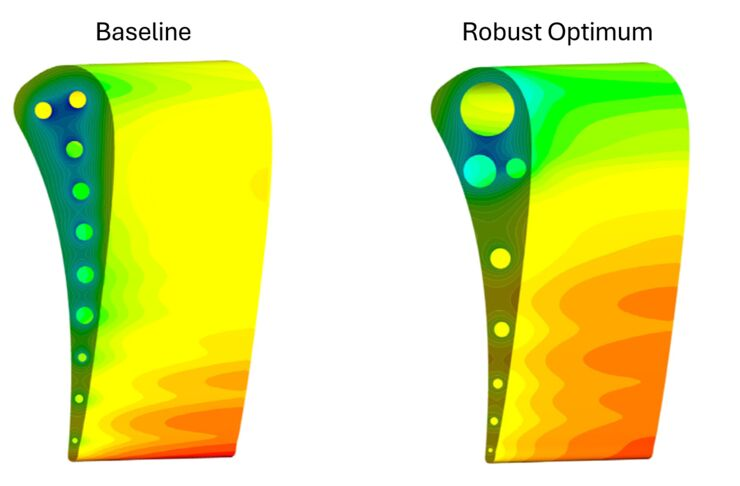

::: {.hero-banner}

::: {.columns}
::: {.column width="25%"}
{width=85% fig-align="left"}

  <a href="https://liu.se/en/employee/saesa86" class="iconbtn" aria-label="LiU Profile"><i class="fa-solid fa-university"></i></a>
  <a href="mailto:saeed.salehi@liu.se" class="iconbtn" aria-label="Email"><i class="fa-solid fa-envelope"></i></a>
  <a href="https://scholar.google.com/citations?hl=en&user=6bn6bn0AAAAJ&view_op=list_works&sortby=pubdate" class="iconbtn" aria-label="Google Scholar"><i class="fa-solid fa-graduation-cap"></i></a>
  <a href="https://www.researchgate.net/profile/Saeed-Salehi-3?ev=hdr_xprf" class="iconbtn" aria-label="ResearchGate"><i class="fa-brands fa-researchgate"></i></a>
  <a href="https://github.com/salehisaeed" class="iconbtn" aria-label="GitHub"><i class="fa-brands fa-github"></i></a>
  <a href="https://www.linkedin.com/in/saeed-salehi-3b97685a/" class="iconbtn" aria-label="LinkedIn"><i class="fa-brands fa-linkedin"></i></a>

:::
::: {.column width="75%"}

# Saeed Salehi

**Associate Professor of Fluid Mechanics**\
Division of Applied Thermodynamics and Fluid Mechanics\
Department of Management and Engineering\
Linköping University

---

I am Associate Professor of Fluid Mechanics at Linköping University. I study complex fluid flows using high-fidelity Computational Fluid Dynamics (CFD). My research combines data-driven approaches and machine learning with CFD to develop efficient and reliable tools for simulation, model order reduction, control, and uncertainty quantification.

I am first and foremost a CFD specialist. To me, CFD is more than a black box, and I am particularly engaged in open-source development, especially with OpenFOAM. Additionally, I am also passionate about data-driven modeling, and how it can be combined with CFD. My doctoral research focused on uncertainty quantification of turbulent flows in turbomachinery, where I developed sparse and efficient methods to assess operational and geometrical uncertainties and applied robust optimization under uncertainty. During my postdoc at Chalmers University of Technology, I developed numerical methods, in OpenFOAM, for transient simulations of hydraulic turbines and expanded into reduced-order modeling, studying approaches such as POD, SPOD, DMD, and sparsity-promoting DMD.

More recently, my research has focused on integrating Artificial Intelligence (AI) with CFD. I have investigated flow control using Deep Reinforcement Learning (DRL) in OpenFOAM and developed multi-fidelity physics-informed neural networks (PINNs) for solving PDEs. This line of work places my research at the intersection of high-fidelity CFD and data-driven methods, with the aim of creating efficient, robust, and trustworthy approaches for the simulation, analysis, and control of complex flows.

:::
:::

:::

---

## News

- **[PhD position available](project-hydropower-ai.html)** in AI-based flow control for hydraulic turbines (ÅForsk-funded project)
- New paper: [Lifetime analysis of hydro turbines](https://doi.org/10.1016/j.rser.2025.116578) published in *Renewable and Sustainable Energy Reviews* (2026)
- New paper: [Physics-informed neural networks for linear free surface waves](https://doi.org/10.1063/5.0277421) published in *Physics of Fluids* (2025)

---

## Computational and data-driven fluid dynamics for complex flows

::: {.grid-cards}

::: {.columns}
::: {.column width="33%"}
::: {.home-card}
[{fig-alt="Deep reinforcement learning for flow control"}](research.qmd#deep-reinforcement-learning-for-flow-control)

[**DRL for flow control**](research.qmd#deep-reinforcement-learning-for-flow-control)\
Deep reinforcement learning for active control of turbulent flows
:::
:::

::: {.column width="33%"}
::: {.home-card}
[{fig-alt="Transient simulation of hydraulic turbines"}](research.qmd#resolved-simulation-of-hydraulic-turbines-during-transient-operation)

[**Transient turbine CFD**](research.qmd#resolved-simulation-of-hydraulic-turbines-during-transient-operation)\
High-fidelity simulation of hydraulic turbines during transient operation
:::
:::

::: {.column width="33%"}
::: {.home-card}
[{fig-alt="Uncertainty quantification of turbulent flows"}](research.qmd#uncertainty-quantification-of-turbulent-flows)

[**Uncertainty quantification**](research.qmd#uncertainty-quantification-of-turbulent-flows)\
Efficient UQ methods for turbulent and industrial flows
:::
:::
:::

:::

[See all research projects &rarr;](research.qmd)

---

## Recent publications

- M. Nobilo, S. Salehi, and H. Nilsson, "Lifetime analysis of hydro turbines with focus on fatigue damage in a renewable energy system," *Renewable and Sustainable Energy Reviews*, 2026. [DOI](https://doi.org/10.1016/j.rser.2025.116578)

- M. Sheikholeslami, S. Salehi, W. Mao, A. Eslamdoost, and H. Nilsson, "Physics-informed neural networks with hard and soft boundary conditions for linear free surface waves," *Physics of Fluids*, 2025. [DOI](https://doi.org/10.1063/5.0277421)

- S. Salehi, "An efficient intrusive deep reinforcement learning framework for OpenFOAM," *Meccanica*, vol. 60, no. 6, pp. 1673-1693, 2025. [DOI](https://doi.org/10.1007/s11012-024-01830-1)

- S. Salehi and H. Nilsson, "Modal analysis of vortex rope using dynamic mode decomposition," *Physics of Fluids*, vol. 36, no. 2, 2024. [DOI](https://doi.org/10.1063/5.0186871)

[Full publication list &rarr;](publications.qmd)
