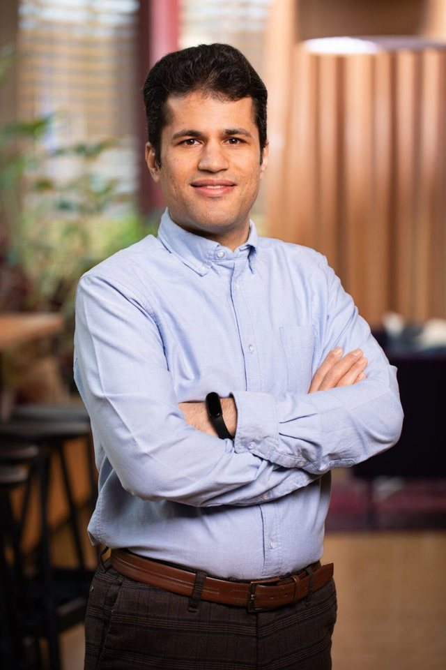
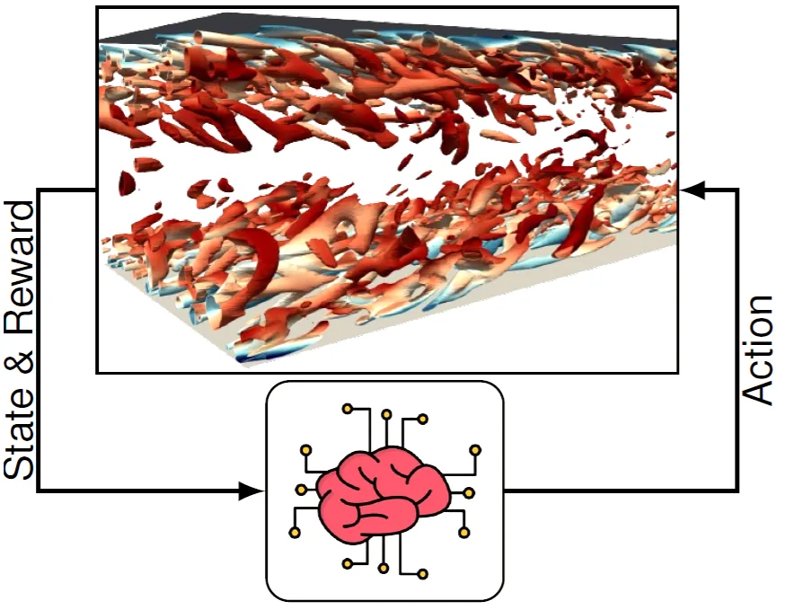

::: {.home}

```{=html}
<section class="hero" aria-labelledby="hero-name">
  <div class="hero-photo">
    
  </div>
  <div>
    <p id="hero-name" class="hero-name" role="heading" aria-level="1">Saeed Salehi</p>
    <p class="hero-role">Associate Professor of Fluid Mechanics, Docent</p>
    <p class="hero-affil">Division of Applied Thermodynamics and Fluid Mechanics · Department of Management and Engineering · Linköping University, Sweden</p>
    <p class="hero-intro">I study complex fluid flows with high-fidelity computational fluid dynamics (CFD), and combine CFD with data-driven methods and machine learning to build efficient and reliable tools for simulation, model reduction, flow control and uncertainty quantification. Much of my work concerns hydraulic turbines and the flexible operation of hydropower.</p>
    <p class="hero-intro">I am first and foremost a CFD specialist and an active OpenFOAM developer. My current focus is deep reinforcement learning for active flow control, coupled directly to CFD.</p>
  </div>
</section>
```



```{=html}
<div class="section-head">
  <h2 id="research">Research themes</h2>
  <a href="research.html">All research →</a>
</div>
<div class="theme-grid">
  <a class="theme-card" href="research.html#flow-control">
    <div class="theme-img"></div>
    <div class="theme-body"><h3>Reinforcement-learning flow control</h3><p>Deep reinforcement learning coupled with CFD for active control of unsteady and turbulent flows.</p></div>
  </a>
  <a class="theme-card" href="research.html#turbine-transients">
    <div class="theme-img"></div>
    <div class="theme-body"><h3>Hydraulic turbine transients</h3><p>Resolved simulation of start-up, shutdown and load changes, with new mesh-motion methods in OpenFOAM.</p></div>
  </a>
  <a class="theme-card" href="research.html#modal-analysis">
    <div class="theme-img"></div>
    <div class="theme-body"><h3>Modal analysis and reduced-order models</h3><p>POD, SPOD and DMD to extract coherent structures and dominant frequencies from simulation data.</p></div>
  </a>
  <a class="theme-card" href="research.html#pinns">
    <div class="theme-img"></div>
    <div class="theme-body"><h3>Physics-informed neural networks</h3><p>Multi-fidelity PINNs for solving partial differential equations, including free-surface waves.</p></div>
  </a>
  <a class="theme-card" href="research.html#uq">
    <div class="theme-img"></div>
    <div class="theme-body"><h3>Uncertainty quantification</h3><p>Sparse and multi-fidelity polynomial chaos methods and robust design under uncertainty.</p></div>
  </a>
  <a class="theme-card" href="research.html#hydropower">
    <div class="theme-img"></div>
    <div class="theme-body"><h3>Flexible hydropower</h3><p>Flow-induced loads, turbine lifetime and contra-rotating pump-turbines for energy storage.</p></div>
  </a>
</div>
```

::: {.home-columns}

::: {}

```{=html}
<div class="section-head"><h2 id="news">News</h2></div>
<ul class="news-list">
  <li><span class="news-date">Sep 2026</span><span>The application period for the <a href="project-hydropower-ai.html">PhD position in AI-based flow control for hydropower</a> has closed, and assessment and recruitment are under way. We received a large number of applications, so this will take some time. Thank you to all applicants for your patience.</span></li>
  <li><span class="news-date">Jul 2026</span><span>Talk on closed-loop control of the vortex rope in a swirl generator with deep reinforcement learning, and session chair, at the 21st OpenFOAM Workshop in Guimarães, Portugal.</span></li>
  <li><span class="news-date">Jun 2026</span><span>New PhD position in AI-based active flow control for hydraulic turbines, funded by the ÅForsk Foundation (see the <a href="project-hydropower-ai.html">project page</a>). Application deadline: 31 August 2026.</span></li>
  <li><span class="news-date">May 2026</span><span>Invited talk, <em>Towards efficient control of turbulence</em>, at the Swedish Society for Industrial Flow and Heat Transfer in Lund.</span></li>
  <li><span class="news-date">Mar 2026</span><span>Talk on transfer learning for reinforcement-learning-based flow control, and session chair, at the 3rd ERCOFTAC Workshop on Machine Learning for Fluid Dynamics in Amsterdam.</span></li>
  <li><span class="news-date">Feb 2026</span><span>Awarded the title of Docent in Fluid Mechanics at Linköping University.</span></li>
  <li><span class="news-date">2026</span><span>Appointed Section Editor of the <a href="https://journal.openfoam.com/index.php/ofj/about/editorialTeam">OpenFOAM Journal</a>.</span></li>
  <li><span class="news-date">2026</span><span>New review papers on <a href="https://doi.org/10.1016/j.rineng.2026.112399">PINNs for the lid-driven cavity problem</a> (<em>Results in Engineering</em>) and on <a href="https://doi.org/10.1016/j.rser.2025.116578">lifetime analysis of hydro turbines</a> (<em>Renewable and Sustainable Energy Reviews</em>).</span></li>
  <li><span class="news-date">Oct 2025</span><span>Preprint: <a href="https://arxiv.org/abs/2510.16016">Transfer learning strategies for accelerating reinforcement-learning-based flow control</a>.</span></li>
  <li><span class="news-date">Aug 2025</span><span>Joined Linköping University as Associate Professor of Fluid Mechanics.</span></li>
</ul>
```

:::

::: {}

```{=html}
<div class="section-head"><h2 id="current-project">Current project</h2></div>
<div class="callout-box">
  <p class="eyebrow">ÅForsk Early-Career Research Grant</p>
  <h3>Enabling flexible hydropower operation by AI-based active flow control</h3>
  <p>Deep reinforcement learning coupled with high-fidelity CFD to suppress harmful flow instabilities in hydraulic turbines at off-design operation. A PhD student is being recruited at Linköping University.</p>
  <p><a href="project-hydropower-ai.html">About the project →</a></p>
</div>
<div class="callout-box">
  <p class="eyebrow">Students</p>
  <h3>Thesis projects and PhD opportunities</h3>
  <p>I supervise MSc and BSc theses in CFD, OpenFOAM development and machine learning for fluid flows, and I support applications for external PhD and postdoc fellowships.</p>
  <p><a href="opportunities.html">Opportunities →</a></p>
</div>
```

:::

:::

```{=html}
<div class="section-head">
  <h2 id="recent-publications">Recent publications</h2>
  <a href="publications.html">All publications →</a>
</div>
```



:::
