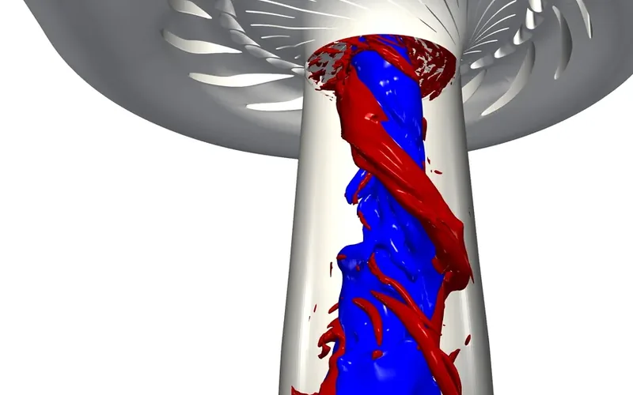
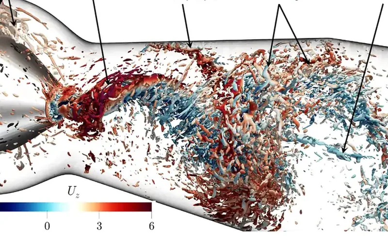
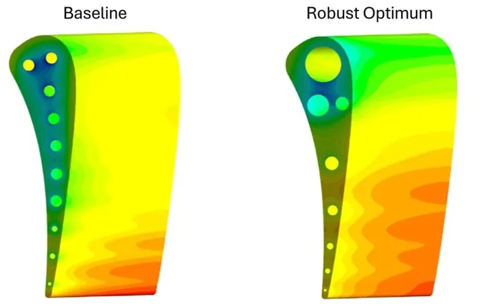
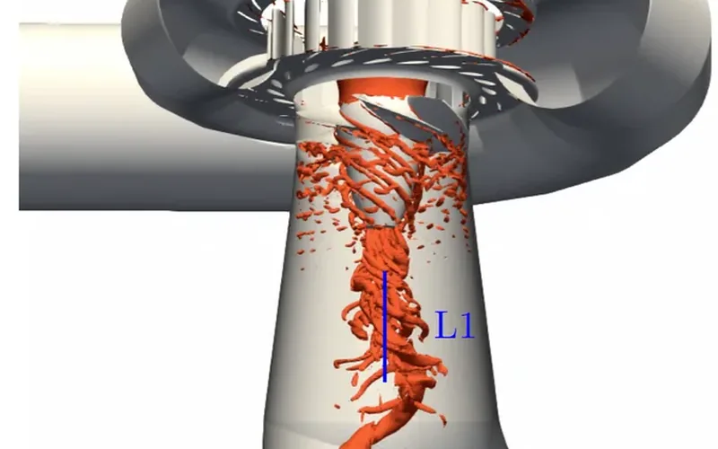

::: {.home}

```{=html}
<section class="hero" aria-labelledby="hero-name">
  <div class="hero-photo">
    
  </div>
  <div>
    <p id="hero-name" class="hero-name" role="heading" aria-level="1">Saeed Salehi</p>
    <p class="hero-role">Associate Professor of Fluid Mechanics, Docent</p>
    <p class="hero-affil">Division of Applied Thermodynamics and Fluid Mechanics · Department of Management and Engineering · Linköping University, Sweden</p>
    <p class="hero-intro">I study complex fluid flows with high-fidelity computational fluid dynamics (CFD), and combine it with data-driven methods and machine learning to build efficient and reliable tools for simulation, reduced-order modelling, flow control and uncertainty quantification. The applications range from canonical flows to turbomachinery and energy systems.</p>
    <p class="hero-intro">I am first and foremost a CFD specialist and an active OpenFOAM developer. My current focus is deep reinforcement learning for active flow control, coupled directly to the flow solver.</p>
  </div>
</section>
```



```{=html}
<div class="section-head">
  <h2 id="research">Research themes</h2>
  <a href="research.html">All research →</a>
</div>
<div class="theme-grid">
  <a class="theme-card" href="research.html#flow-control">
    <div class="theme-img theme-img-contain"></div>
    <div class="theme-body"><h3>Reinforcement-learning flow control</h3><p>Deep reinforcement learning coupled with CFD for active control of unsteady and turbulent flows.</p></div>
  </a>
  <a class="theme-card" href="research.html#turbine-transients">
    <div class="theme-img"></div>
    <div class="theme-body"><h3>Hydraulic turbine transients</h3><p>Resolved simulation of start-up, shutdown and load changes, with new mesh-motion methods in OpenFOAM.</p></div>
  </a>
  <a class="theme-card" href="research.html#modal-analysis">
    <div class="theme-img"></div>
    <div class="theme-body"><h3>Modal analysis and reduced-order models</h3><p>POD, SPOD and DMD to extract coherent structures and dominant frequencies from simulation data.</p></div>
  </a>
  <a class="theme-card" href="research.html#pinns">
    <div class="theme-img theme-img-contain"></div>
    <div class="theme-body"><h3>Physics-informed neural networks</h3><p>Multi-fidelity PINNs for solving partial differential equations, including free-surface waves.</p></div>
  </a>
  <a class="theme-card" href="research.html#uq">
    <div class="theme-img"></div>
    <div class="theme-body"><h3>Uncertainty quantification</h3><p>Sparse and multi-fidelity polynomial chaos methods and robust design under uncertainty.</p></div>
  </a>
  <a class="theme-card" href="research.html#hydropower">
    <div class="theme-img"></div>
    <div class="theme-body"><h3>Flexible hydropower</h3><p>Flow-induced loads, turbine lifetime and contra-rotating pump-turbines for energy storage.</p></div>
  </a>
</div>
```

::: {.home-columns}

::: {}

```{=html}
<div class="section-head">
  <h2 id="news">News</h2>
  <a href="news.html">All news →</a>
</div>
```



:::

::: {}

```{=html}
<div class="section-head"><h2 id="current-project">Current project</h2></div>
<div class="callout-box">
  <p class="eyebrow">ÅForsk Early-Career Research Grant</p>
  <h3>Enabling flexible hydropower operation by AI-based active flow control</h3>
  <p>Deep reinforcement learning coupled with high-fidelity CFD to suppress harmful flow instabilities in hydraulic turbines at off-design operation. Funded by the ÅForsk Foundation, 2027–2031, with a doctoral student being recruited at Linköping University.</p>
  <p><a href="project-hydropower-ai.html">About the project →</a></p>
</div>
<div class="callout-box">
  <p class="eyebrow">Students</p>
  <h3>Thesis projects and PhD opportunities</h3>
  <p>I supervise MSc and BSc theses in CFD, OpenFOAM development and machine learning for fluid flows, and I support applications for external PhD and postdoctoral fellowships.</p>
  <p><a href="opportunities.html">Opportunities →</a></p>
</div>
```

:::

:::

```{=html}
<div class="section-head">
  <h2 id="recent-publications">Recent publications</h2>
  <a href="publications.html">All publications →</a>
</div>
```



:::
