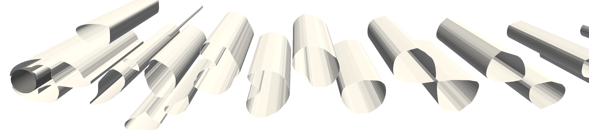
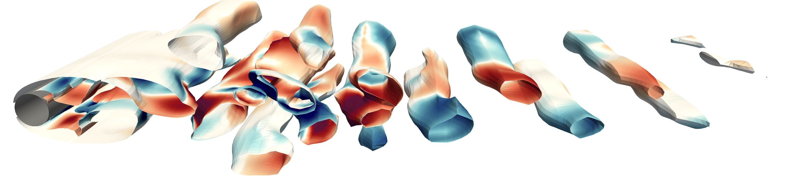
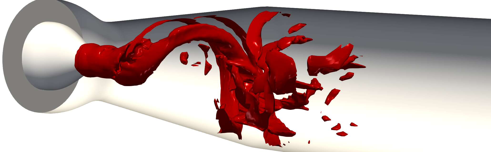
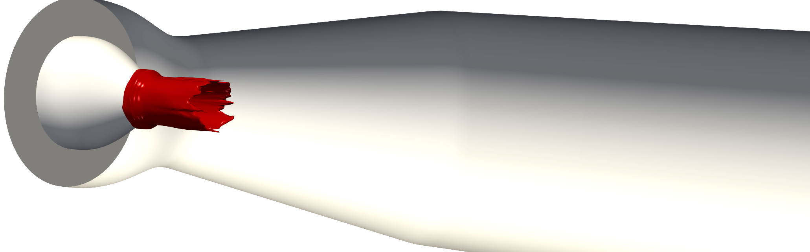
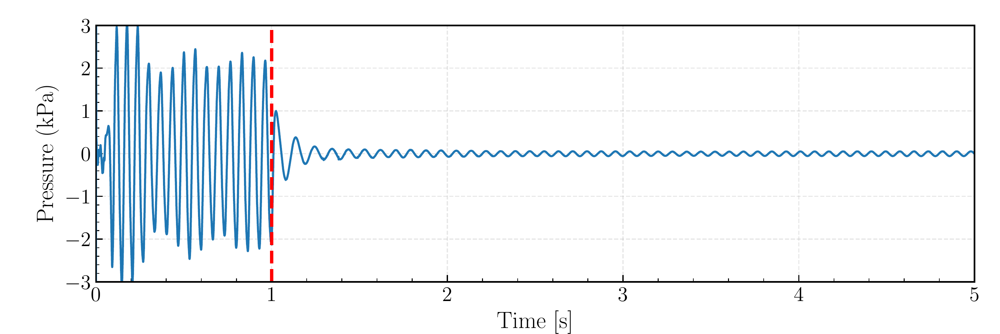

::: {.callout-note appearance="simple"}
This page provides detailed information about the research project for prospective PhD applicants. See the [job advertisement](https://liu.se/en/work-at-liu/vacancies/29533) for application details. Application deadline: **August 31, 2026**.
:::

## Project summary

This project investigates AI-based active flow control for mitigating harmful flow instabilities in hydraulic turbines operating under off-design conditions. By coupling Deep Reinforcement Learning (DRL) with high-fidelity Computational Fluid Dynamics (CFD), the project aims to create a feedback-driven control framework that stabilizes the flow across varying operating regimes, contributing to safer and more flexible hydropower operation.

{fig-alt="Conceptual illustration of the AI-based active flow control framework for hydraulic turbines" width=85%}

The project is funded by: [ÅForsk Foundation](https://aforsk.com/), with co-funding from the Linköping University.\
**Principal investigator:** [Saeed Salehi](https://liu.se/en/employee/saesa86), Linköping University\
**Co-supervisor:** [Håkan Nilsson](https://www.chalmers.se/en/persons/hani/), Chalmers University of Technology\
The project is carried out as a collaboration between the [Division of Applied Thermodynamics and Fluid Mechanics](https://liu.se/en/organisation/liu/iei/mvs) at Linköping University and the [Division of Fluid Dynamics](https://www.chalmers.se/en/departments/me/research/fluid-dynamics/) at Chalmers University of Technology.

---

## Background and motivation

The increasing penetration of intermittent energy sources such as wind and solar power places greater demands on hydropower to operate more flexibly to balance the electric grid. This flexible operation involves frequent starts and stops, continuous regulation, and prolonged operation at off-design conditions. These operations are known to promote strong self-induced flow instabilities that generate harmful pressure pulsations ([Salehi and Nilsson, 2021](https://doi.org/10.1016/j.renene.2021.07.107); [Salehi and Nilsson, 2022](https://doi.org/10.1016/j.renene.2022.01.111)), accelerate structural fatigue, reduce lifetime, and limit the safe operating range of hydraulic turbines ([Nobilo et al., 2026](https://doi.org/10.1016/j.rser.2025.116578)).

).](img/rvr_shutdown.jpg){fig-alt="Helical vortex rope instability in a Francis turbine draft tube during shutdown" width=60%}

Several strategies have been proposed to mitigate flow instabilities in hydraulic turbines. Passive approaches rely on geometric modifications of the runner or draft tube to weaken instabilities or stabilize the flow. Active flow control techniques typically employ air admission or water injection supplied by external energy sources. Air admission redistributes low-pressure regions to damp pulsations, whereas water injection directly alters the angular momentum of the swirling flow.

Despite the progress in passive and active mitigation strategies, most reported approaches rely on predefined geometric modifications or actuation settings tailored to specific operating conditions, without adaptive feedback from the evolving flow field. While these strategies may reduce pressure fluctuations and their associated vibrations, their performance is limited to specific operating regimes and is sensitive to tuning. In addition, most active control strategies do not explicitly account for performance optimality; instability mitigation is often achieved at the expense of increased actuation energy or reduced turbine efficiency.

These limitations motivate the development of feedback-based control strategies that maintain effective instability mitigation across varying operating conditions while minimizing additional energy consumption and limiting turbine efficiency degradation. **This is the main purpose of this project.**

---

## Approach

The high-dimensional and nonlinear dynamics of turbine instabilities limit the practical applicability of conventional model-based control methods. Deep Reinforcement Learning (DRL) offers an alternative by enabling systematic optimization of control policies directly from flow observations in complex dynamical systems. Recent advances in DRL have demonstrated the ability to construct feedback control policies for complex, nonlinear flow systems, including laminar ([Rabault et al., 2019](https://doi.org/10.1017/jfm.2019.62)), weakly turbulent ([Ren et al., 2021](https://doi.org/10.1063/5.0037371)), and fully turbulent flows ([Sonoda et al., 2023](https://doi.org/10.1017/jfm.2023.147)), though predominantly in simplified settings rather than realistic engineering systems.

In the proposed framework, a deep neural network (the agent) interacts with a high-fidelity CFD simulation in a closed loop: the agent observes the flow state, selects a control action (e.g., jet actuation), and receives a reward signal reflecting the degree of instability suppression. Through iterative training, the agent learns a control policy that adapts to the flow dynamics, without requiring an explicit mathematical model of the instability.

With DRL-based flow control showing promising results in canonical configurations, extending these approaches to practical engineering systems such as turbine instability problems is a logical next step.

---

## Previous research

The project builds on previous work in high-fidelity simulation of hydraulic turbine flows and reinforcement learning-based flow control. Much of this groundwork was carried out while the PI was a researcher at Chalmers University of Technology, funded by the [Swedish Centre for Sustainable Hydropower (SVC)](https://svc.energiforsk.se/).

### High-fidelity simulation of hydraulic turbines

Previous work includes high-fidelity simulations of hydraulic turbines under steady, off-design, and transient operations, covering vortex rope dynamics, shutdown and start-up transients, and uncertainty quantification in Francis turbines, Kaplan turbines, pump-turbines, and swirl generator configurations (e.g., [Salehi and Nilsson, 2021](https://doi.org/10.1016/j.renene.2021.07.107); [Salehi and Nilsson, 2022](https://doi.org/10.1016/j.renene.2022.01.111); [Salehi and Nilsson, 2023](https://doi.org/10.1016/j.cpc.2023.108703); [Salehi and Nilsson, 2024](https://doi.org/10.1063/5.0186871); [Masoodi et al., 2024a](https://doi.org/10.1063/5.0187104); [Masoodi et al., 2024b](https://doi.org/10.1063/5.0222739)).

### DRL-CFD coupling framework

In parallel, we have developed a computational framework for coupling DRL with the CFD solver OpenFOAM ([Salehi, 2025](https://doi.org/10.1007/s11012-024-01830-1)). The framework enables efficient closed-loop integration between learning algorithms and high-fidelity flow simulations and has been released as open-source software: [TensorforceFoam on GitHub](https://github.com/salehisaeed/TensorforceFoam).

The methodology has been applied to active flow control problems. The figures below illustrate representative results, including successful control of vortex-dominated flow structures in both 2D and 3D configurations.

). The learned control policy suppresses the vortex shedding.](img/contours_proposal.png){fig-alt="Comparison of uncontrolled and DRL-controlled flow past a 2D cylinder" width=90%}

::: {layout-ncol=2}
{fig-alt="Uncontrolled vortex shedding behind a 3D cylinder"}

{fig-alt="DRL-controlled flow behind a 3D cylinder showing suppressed vortex shedding"}
:::

### Proof-of-concept: DRL control of draft tube instability

As a first step toward the present project, we conducted a proof-of-concept study on a swirl generator configuration representing a simplified hydraulic turbine draft tube. A DRL controller was coupled to a 3D CFD model with localized axial jet actuation at the runner cone.

::: {layout-ncol=2}
{fig-alt="Uncontrolled helical vortex rope in the swirl generator draft tube"}

{fig-alt="Vortex rope significantly reduced under DRL-based closed-loop control"}
:::

Under closed-loop control, the strength of the helical flow instability is reduced compared to the uncontrolled case. The corresponding time evolution of the rotating pressure mode is shown below. When the controller is activated at $t = 1$ s (dashed red line), the rotating mode amplitude decreases and stabilizes at a lower level.

{fig-alt="Time series showing rapid suppression of pressure pulsations after DRL controller activation" width=80%}

This preliminary study considered a simplified geometry, a single operating condition, and a basic actuation setup to establish feasibility. Extending this framework to realistic turbine configurations, multiple operating regimes, advanced actuator concepts, and higher-fidelity simulations is the next step and constitutes the core of this project.

---

## What is new in this project

To date, no DRL-based closed-loop control framework has been applied to instability mitigation in realistic hydraulic turbine configurations. This project aims to fill that gap by integrating DRL directly with high-fidelity CFD of turbines, moving beyond predefined geometric modifications and open-loop actuation toward regime-robust, efficiency-aware control across off-design operating conditions.

---

## Selected related publications

For more details on the scientific background and methods behind this project, see the following selected publications. A complete list is available on the [Publications page](publications.qmd).

- M. Nobilo, S. Salehi, and H. Nilsson, "Lifetime analysis of hydro turbines with focus on fatigue damage in a renewable energy system -- A review," *Renewable and Sustainable Energy Reviews*, 2026. [DOI: 10.1016/j.rser.2025.116578](https://doi.org/10.1016/j.rser.2025.116578)

- S. Salehi, "An efficient intrusive deep reinforcement learning framework for OpenFOAM," *Meccanica*, vol. 60, no. 6, pp. 1673-1693, 2025. [DOI: 10.1007/s11012-024-01830-1](https://doi.org/10.1007/s11012-024-01830-1)

- F. A. Masoodi, S. Salehi, and R. Goyal, "Reorganization of flow field due to load rejection driven self-mitigation of high load vortex breakdown in a Francis turbine," *Physics of Fluids*, vol. 36, no. 9, p. 094110, 2024. [DOI: 10.1063/5.0222739](https://doi.org/10.1063/5.0222739)

- S. Salehi and H. Nilsson, "Modal analysis of vortex rope using dynamic mode decomposition," *Physics of Fluids*, vol. 36, no. 2, p. 024122, 2024. [DOI: 10.1063/5.0186871](https://doi.org/10.1063/5.0186871)

- F. A. Masoodi, S. Salehi, and R. Goyal, "Formation and evolution of vortex breakdown consequent to post design flow increase in a Francis turbine," *Physics of Fluids*, vol. 36, no. 2, p. 025116, 2024. [DOI: 10.1063/5.0187104](https://doi.org/10.1063/5.0187104)

- S. Salehi and H. Nilsson, "A semi-implicit slip algorithm for mesh deformation in complex geometries, implemented in OpenFOAM," *Computer Physics Communications*, vol. 287, p. 108703, 2023. [DOI: 10.1016/j.cpc.2023.108703](https://doi.org/10.1016/j.cpc.2023.108703)

- S. Salehi and H. Nilsson, "Flow-induced pulsations in Francis turbines during startup," *Renewable Energy*, 2022. [DOI: 10.1016/j.renene.2022.01.111](https://doi.org/10.1016/j.renene.2022.01.111)

- S. Salehi, H. Nilsson, E. Lillberg, and N. Edh, "An in-depth numerical analysis of transient flow field in a Francis turbine during shutdown," *Renewable Energy*, vol. 179, pp. 2322-2347, 2021. [DOI: 10.1016/j.renene.2021.07.107](https://doi.org/10.1016/j.renene.2021.07.107)

---

## Contact

Feel free to reach out if you have any questions about the project or the PhD position.

**Saeed Salehi**\
Associate Professor of Fluid Mechanics\
Linköping University\
[saeed.salehi@liu.se](mailto:saeed.salehi@liu.se)
