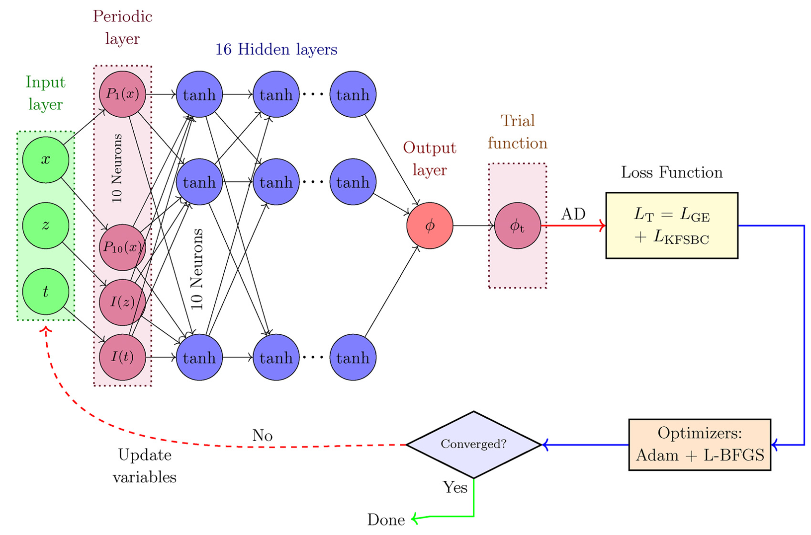
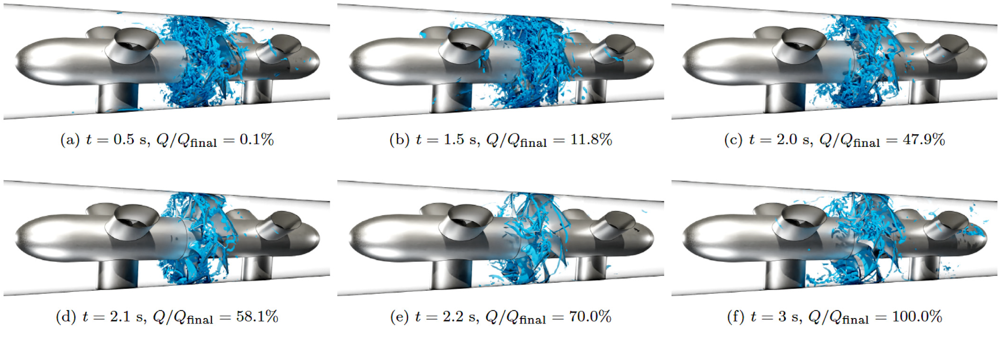
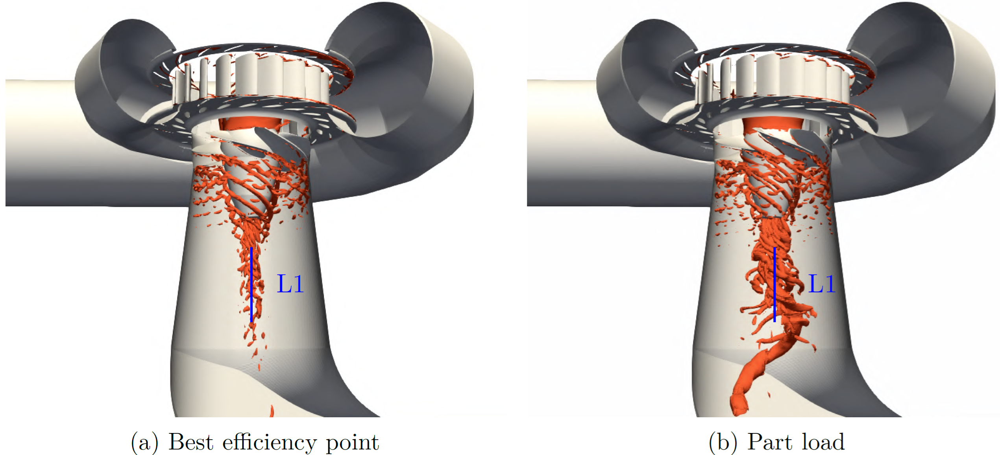

## Overview
My research combines Computational Fluid Dynamics (CFD) with data science and machine learning to better understand, predict, and control complex flow systems. I focus on methods that are efficient, robust, and generalizable for both fundamental studies and applications in turbulent flows and turbomachinery. The following highlights several key projects and results in these areas.

---

## [Deep Reinforcement Learning for Flow Control](drl.qmd)
A major line of work is deep reinforcement learning (DRL) for active flow control. DRL promises sophisticated control strategies beyond classical methods, but current DRL–CFD frameworks struggle with efficiency, robustness, and generalization. My approach combines multifidelity learning, transfer learning, and robust learning under uncertainty to push DRL toward realistic high-Reynolds-number flows and deliver controllers that transfer across operating conditions.

::: {.research-card}
[{fig-alt="Schematic of the deep reinforcement learning pipeline for CFD-based flow control"}](drl.qmd)
:::

---

## [Resolved Simulation of Hydraulic Turbines During Transient Operation](transient.qmd)
I develop and use high-fidelity CFD to study complex, transient turbomachinery flows. I created semi-implicit mesh-deformation techniques in OpenFOAM to simulate the complex mesh motion of hydraulic turbines during transient operation. These simulations provide detailed analysis of complex physics during such operations, providing insights into transient flow instabilities.

::: {.research-card}
[{fig-alt="CFD visualization of transient flow in a hydraulic turbine during shutdown"}](transient.qmd)
:::

---

## [High-Resolved Simulations and Reduced-Order Modeling of Turbomachinery Flows](rom.qmd)
High-fidelity CFD and dynamic mode decomposition (DMD) were used to analyze vortex rope instabilities in hydraulic turbines, revealing key coherent structures and dominant frequency modes that inform future control strategies.

::: {.research-card}
[{fig-alt="DMD analysis of vortex rope instabilities in a hydraulic turbine"}](rom.qmd)
:::

---

## [Uncertainty Quantification of Turbulent Flows](uq.qmd)
I have developed efficient uncertainty quantification (UQ) methods for turbulent and industrial flows. I introduced sparse polynomial chaos, compressed sensing, and multifidelity $\ell_1$-minimization to reduce computational cost while retaining accuracy. These methods were applied to operational and geometrical uncertainties in turbomachinery and used for robust optimization.

::: {.research-card}
[{fig-alt="Visualization of uncertainty quantification results for turbulent flow simulation"}](uq.qmd)
:::

---

## [Physics-Informed Neural Networks for PDEs](pinn.qmd)
Physics-informed neural networks (PINNs) were applied to the linear wave problem from potential flow theory, exploring both soft and hard enforcement of boundary conditions.

::: {.research-card}
[{fig-alt="PINN solution of a linear wave problem from potential flow theory"}](pinn.qmd)

(Contributor: PhD student Mohammad Sheikholeslami)
:::

---

## [Flow in Contra-Rotating Pump-Turbine](alpheus.qmd)
This project studied contra-rotating pump-turbines (CRPT) for low-head pumped hydro storage. CFD simulations show high efficiency in both pump and turbine modes, while transient and cavitation analyses highlight the need for careful valve control and reveal performance degradation under cavitating conditions.

::: {.research-card}
[{fig-alt="CFD simulation of a contra-rotating pump-turbine for pumped hydro storage"}](alpheus.qmd)

(Contributor: PhD student Jonathan Fahlbeck)
:::

---

## [Analysis of Flow-Induced Loads in Kaplan Turbine](kaplan.qmd)
This project examined the effects of flexible hydropower operation on turbine lifetime. CFD simulations on a Kaplan turbine model reveal how flow-induced forces, pressure pulsations, and rotating vortex rope dynamics impact loads during part-load and transient conditions. The results provide input for fatigue lifetime analysis of turbine runners.

::: {.research-card}
[{fig-alt="CFD analysis of flow-induced forces on a Kaplan turbine runner"}](kaplan.qmd)

(Contributor: PhD student Martina Nobilo)
:::
