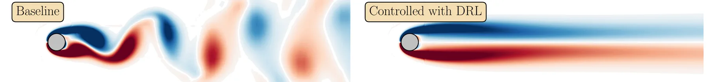
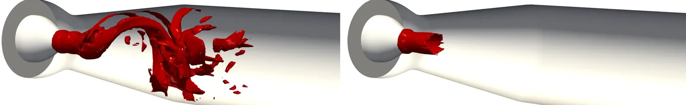
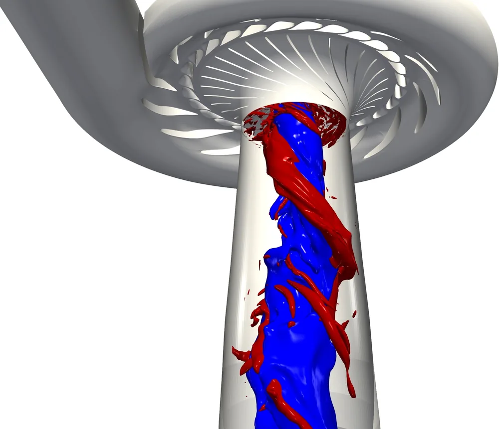
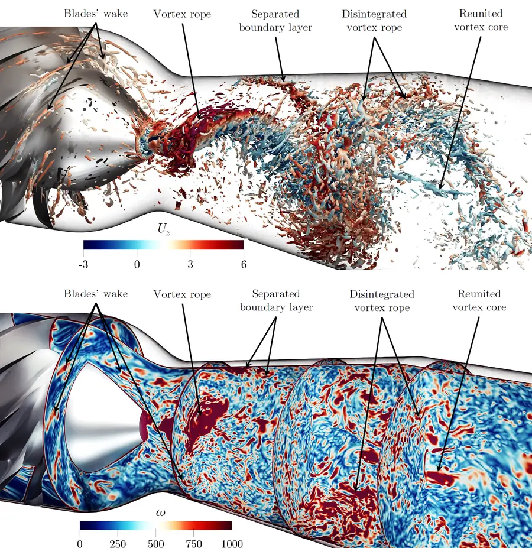
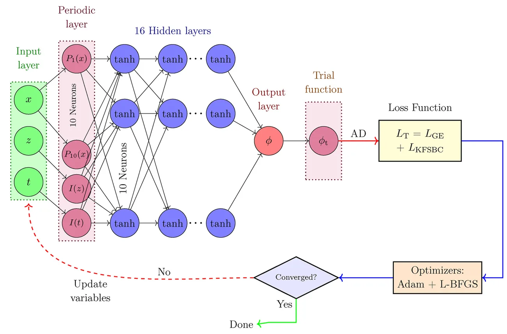
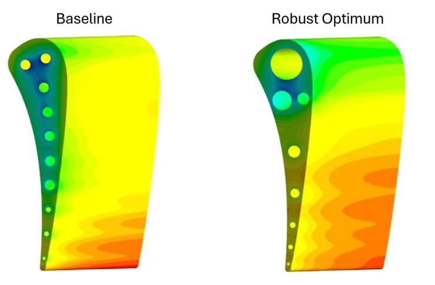
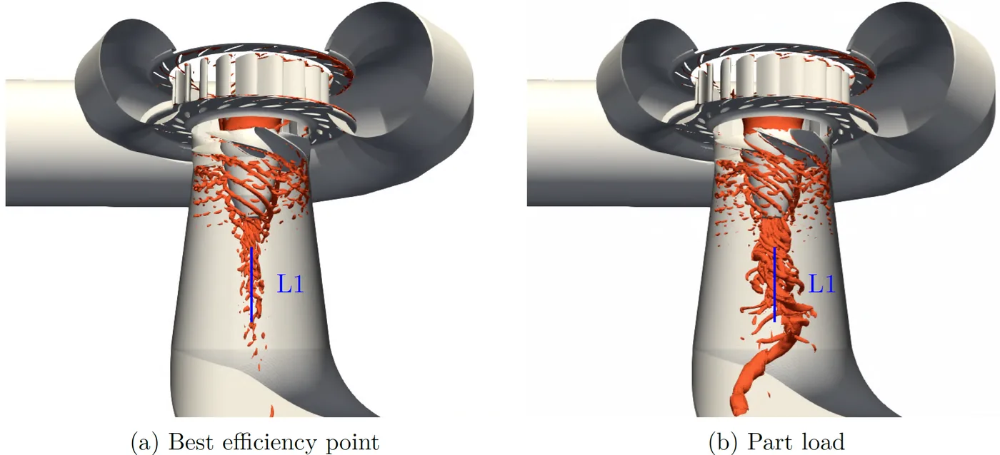
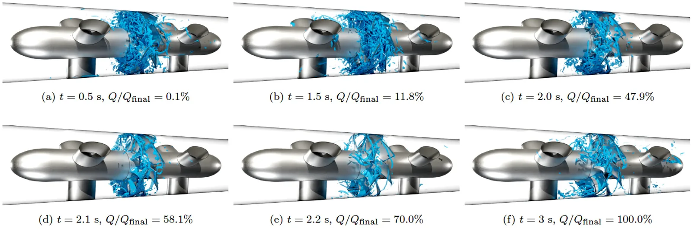

::: {.wide}

I work at the interface between high-fidelity computational fluid dynamics (CFD) and data-driven modelling. The common thread is making expensive simulations useful: extracting the dominant physics from them, quantifying how much to trust them, and turning them into models and controllers that act on the flow. Nearly all of the methods are developed in OpenFOAM and released as [open-source software](software.qmd), and they are tested on problems ranging from canonical flows to turbomachinery.

```{=html}
<ul class="toc-chips" aria-label="Research themes">
  <li><a href="#flow-control">Reinforcement-learning flow control</a></li>
  <li><a href="#turbine-transients">Hydraulic turbine transients</a></li>
  <li><a href="#modal-analysis">High-resolution simulation and reduced-order modelling</a></li>
  <li><a href="#pinns">Physics-informed neural networks</a></li>
  <li><a href="#uq">Uncertainty quantification</a></li>
  <li><a href="#hydropower">Flexible hydropower</a></li>
</ul>
```

::: {.research-theme}
::: {}
## Reinforcement-learning-based flow control {#flow-control}

[Current focus]{.status-chip .status-current}

**The problem.** Unsteady flows such as vortex shedding and the swirling vortex rope in a draft tube are high-dimensional and nonlinear, which limits conventional model-based control. Deep reinforcement learning (DRL) can learn feedback policies directly from flow observations, but DRL–CFD frameworks are expensive to train, sensitive to the training conditions, and are usually demonstrated on canonical cases.

**My approach.** I developed an intrusive DRL framework in which the learning agent runs inside the OpenFOAM solver, so no data are exchanged with an external process during an episode, and parallel environments are handled with MPI. On top of it I study transfer learning, multi-fidelity training and robust learning under uncertainty to bring down the cost and make a learned policy usable away from the conditions it was trained on.

**Results so far.** The framework suppresses vortex shedding behind 2D and 3D cylinders, and a proof-of-concept study on a swirl generator, a simplified model of a turbine draft tube, reduced the strength of the helical vortex rope under closed-loop control with axial jet actuation. Extending this to realistic turbine geometries and several operating regimes is the subject of the [ÅForsk project](project-hydropower-ai.qmd).

**Key work**

- S. Salehi, [An efficient intrusive deep reinforcement learning framework for OpenFOAM](https://doi.org/10.1007/s11012-024-01830-1), *Meccanica*, 60(6), 1673–1693, 2025
- S. Salehi, [Transfer learning strategies for accelerating reinforcement-learning-based flow control](https://arxiv.org/abs/2510.16016), arXiv preprint, 2025
- S. Salehi and H. Nilsson, [A parametric study of axial flow jets for mitigation of vortex rope instabilities](https://doi.org/10.1088/1755-1315/1561/1/012023), *IOP Conf. Ser.: Earth Environ. Sci.*, 1561, 012023, 2025

[Software: [TensorforceFoam](https://github.com/salehisaeed/TensorforceFoam) · [agentJet](https://github.com/salehisaeed/agentJet). Project: [Enabling flexible hydropower operation by AI-based active flow control](project-hydropower-ai.qmd)]{.meta-line}
:::

::: {.research-figure}
{fig-alt="Vorticity contours behind a cylinder: a periodic vortex street without control, and a steady wake under deep reinforcement learning control" width="1800" height="210"}

{fig-alt="Iso-surfaces of the helical vortex rope in a swirl generator: a large rope without control and a much weaker structure under DRL control" width="1400" height="215"}
:::
:::

::: {.research-theme}
::: {}
## Transient operation of hydraulic turbines {#turbine-transients}

[Established line of work]{.status-chip}

**The problem.** As hydropower balances intermittent wind and solar power, turbines start, stop and change load far more often, which exposes them to strong pressure pulsations. Resolving such transients requires the computational mesh to follow moving guide vanes and runner blades without degrading.

**My approach.** I developed a semi-implicit slip algorithm for mesh deformation in complex geometries and implemented it in OpenFOAM: an explicit step based on the general slip condition, an implicit Dirichlet step, and Laplacian smoothing to spread the deformation through the domain, with an optional solid-body rotation for Kaplan runners.

**Results so far.** The method made resolved simulations of Francis and Kaplan turbines during shutdown and start-up sequences possible, showing how the rotating vortex rope forms and decays and how the resulting pulsations evolve. The library is open source and is used by the R&D department of Vattenfall to study transient operation of their hydropower systems.

**Key work**

- S. Salehi, H. Nilsson, E. Lillberg and N. Edh, [An in-depth numerical analysis of transient flow field in a Francis turbine during shutdown](https://doi.org/10.1016/j.renene.2021.07.107), *Renewable Energy*, 179, 2322–2347, 2021
- S. Salehi and H. Nilsson, [Flow-induced pulsations in Francis turbines during startup](https://doi.org/10.1016/j.renene.2022.01.111), *Renewable Energy*, 188, 1166–1183, 2022
- S. Salehi and H. Nilsson, [A semi-implicit slip algorithm for mesh deformation in complex geometries, implemented in OpenFOAM](https://doi.org/10.1016/j.cpc.2023.108703), *Computer Physics Communications*, 287, 108703, 2023
- F. A. Masoodi, S. Salehi and R. Goyal, [Reorganization of flow field due to load rejection driven self-mitigation of high load vortex breakdown in a Francis turbine](https://doi.org/10.1063/5.0222739), *Physics of Fluids*, 36(9), 094110, 2024

[Software: [semiImplicitSlip](https://github.com/salehisaeed/semiImplicitSlip). Dataset: [Francis-99 transients](https://doi.org/10.7910/DVN/31JGOM)]{.meta-line}
:::

::: {.research-figure}
{fig-alt="Red iso-surface of a helical vortex rope below the runner of a Francis turbine during shutdown" width="1000" height="861"}
:::
:::

::: {.research-theme}
::: {}
## High-resolution simulation and reduced-order modelling {#modal-analysis}

[Ongoing]{.status-chip .status-current}

**The problem.** Resolved simulations of turbomachinery produce data sets far too large to interpret directly, yet their dynamics are often governed by a handful of coherent structures and frequencies.

**My approach.** I use modal decompositions, proper orthogonal decomposition (POD), spectral POD, dynamic mode decomposition (DMD) and sparsity-promoting DMD, to separate those structures from the rest of the field and to compress simulation data into low-order descriptions.

**Results so far.** Applied to the vortex rope in a hydraulic turbine, DMD isolates the modes that carry the instability and their frequencies, which gives both a compact description of the dynamics and the quantities a controller has to act on. Compression and prediction of vortex-rope dynamics with spectral POD and autoencoders is offered as an [MSc thesis project](opportunities.qmd).

**Key work**

- S. Salehi and H. Nilsson, [Modal analysis of vortex rope using dynamic mode decomposition](https://doi.org/10.1063/5.0186871), *Physics of Fluids*, 36(2), 024122, 2024
- S. Salehi and H. Nilsson, Dynamic mode decomposition of rotating vortex rope instability, *9th IAHR Meeting of the Work Group on Cavitation and Dynamic Problems in Hydraulic Machinery and Systems*, 2024
:::

::: {.research-figure}
{fig-alt="Annotated vortex rope in a draft tube showing blade wakes, the separated boundary layer, the disintegrated rope and the reunited vortex core" width="900" height="927"}
:::
:::

::: {.research-theme}
::: {}
## Physics-informed neural networks {#pinns}

[Ongoing]{.status-chip .status-current}

**The problem.** Physics-informed neural networks (PINNs) solve partial differential equations by putting the governing equations into the loss function, which avoids meshing but raises questions of accuracy, cost and how boundary conditions should be imposed.

**My approach.** Together with colleagues at Chalmers University of Technology I study multi-fidelity PINNs, in which cheap low-fidelity data are combined with a small amount of accurate data. The linear wave problem from potential flow theory serves as a test case, with soft and hard enforcement of boundary conditions compared directly.

**Results so far.** The free-surface wave study compares hard and soft enforcement of the boundary conditions for the same problem, and a critical review of published implementations for the lid-driven cavity problem sets out where current PINN practice stands. The work is the doctoral project of Mohammad Sheikholeslami, whom I co-supervise.

**Key work**

- M. Sheikholeslami, S. Salehi, W. Mao, A. Eslamdoost and H. Nilsson, [Physics-informed neural networks with hard and soft boundary conditions for linear free surface waves](https://doi.org/10.1063/5.0277421), *Physics of Fluids*, 37(8), 087158, 2025
- M. Sheikholeslami, S. Salehi, W. Mao, A. Eslamdoost and H. Nilsson, [State-of-the-art implementations of PINNs for the lid-driven cavity problem: a critical review with future perspectives](https://doi.org/10.1016/j.rineng.2026.112399), *Results in Engineering*, 32, 112399, 2026
:::

::: {.research-figure}
{fig-alt="Diagram of a physics-informed neural network with a periodic input layer, hidden layers, a trial function and a loss function minimised by Adam and L-BFGS" width="1300" height="858"}
:::
:::

::: {.research-theme}
::: {}
## Uncertainty quantification and robust design {#uq}

[Established line of work]{.status-chip}

**The problem.** Simulation inputs, operating conditions, geometry and turbulence-model coefficients are never known exactly. Propagating that uncertainty with standard polynomial chaos requires far more simulations than an industrial CFD budget allows.

**My approach.** During my doctoral work I combined sparse polynomial chaos with compressed sensing, and developed a multi-fidelity ℓ₁-minimisation method that builds the expansion mostly from cheap simulations while a few expensive ones correct it. The same machinery supports robust optimisation, where a design is chosen to perform well across the uncertainty rather than at a single nominal point.

**Results so far.** The methods cut the number of simulations needed at comparable accuracy, and showed for a centrifugal pump that combined operational and geometrical uncertainties change flow and performance appreciably. Applied to a cooled gas turbine vane, they produced probabilistic predictions and a robust optimum design.

**Key work**

- S. Salehi, M. Raisee, M. J. Cervantes and A. Nourbakhsh, [Efficient uncertainty quantification of stochastic CFD problems using sparse polynomial chaos and compressed sensing](https://doi.org/10.1016/j.compfluid.2017.06.016), *Computers & Fluids*, 154, 296–321, 2017
- S. Salehi, M. Raisee, M. J. Cervantes and A. Nourbakhsh, [An efficient multifidelity ℓ₁-minimization method for sparse polynomial chaos](https://doi.org/10.1016/j.cma.2018.01.055), *Computer Methods in Applied Mechanics and Engineering*, 334, 183–207, 2018
- S. Salehi, M. Raisee, M. J. Cervantes and A. Nourbakhsh, [On the flow field and performance of a centrifugal pump under operational and geometrical uncertainties](https://doi.org/10.1016/j.apm.2018.05.008), *Applied Mathematical Modelling*, 61, 540–560, 2018
- M. S. Karimi, M. Raisee, S. Salehi, P. Hendrick and A. Nourbakhsh, [Robust optimization of the NASA C3X gas turbine vane under uncertain operational conditions](https://doi.org/10.1016/j.ijheatmasstransfer.2020.120537), *International Journal of Heat and Mass Transfer*, 164, 120537, 2021
:::

::: {.research-figure}
{fig-alt="Temperature contours on two cooled turbine vanes, the baseline design and a robust optimum with enlarged cooling holes" width="740" height="486"}
:::
:::

::: {.research-theme}
::: {}
## Flexible hydropower: loads, lifetime and energy storage {#hydropower}

[Ongoing]{.status-chip .status-current}

**The problem.** Flexible operation shortens the life of hydropower machines, and low-head pumped storage needs machines that work well in both pump and turbine mode. Both questions require load data that measurements alone cannot provide.

**My approach.** With PhD students at Chalmers University of Technology I combine resolved CFD of model turbines with load and lifetime analysis. A Kaplan turbine model is used to extract flow-induced forces, pressure pulsations and vortex rope dynamics at part load and during load reduction, which feed fatigue lifetime analysis. In the EU Horizon 2020 project [ALPHEUS](https://alpheus-h2020.eu/) we studied contra-rotating pump-turbines for low-head pumped hydro storage, including start-up and shutdown sequences and cavitating conditions.

**Results so far.** The turbine work quantified how loads on the runner blades change during load reduction and reviewed how transient and off-design operation drives fatigue damage. For the pump-turbine, simulations characterised performance in both modes, showed how mode switching and start-up sequences can be shaped, and quantified the degradation under cavitation. The turbine work is the doctoral project of Martina Nobilo and the pump-turbine work that of Jonathan Fahlbeck, both of whom I co-supervised.

**Key work**

- M. Nobilo, S. Salehi and H. Nilsson, [Lifetime analysis of hydro turbines with focus on fatigue damage in a renewable energy system: a review](https://doi.org/10.1016/j.rser.2025.116578), *Renewable and Sustainable Energy Reviews*, 228, 116578, 2026
- M. Nobilo, S. Salehi and H. Nilsson, [On the flow-induced pulsating forces during load reduction of a Kaplan turbine model](https://doi.org/10.1088/1755-1315/1483/1/012022), *IOP Conf. Ser.: Earth Environ. Sci.*, 1483, 012022, 2025
- J. Fahlbeck, H. Nilsson, M. H. Arabnejad and S. Salehi, [Performance characteristics of a contra-rotating pump-turbine in turbine and pump modes under cavitating flow conditions](https://doi.org/10.1016/j.renene.2024.121605), *Renewable Energy*, 237, 121605, 2024
- J. Fahlbeck, H. Nilsson and S. Salehi, [Surrogate based optimisation of a pump mode startup sequence for a contra-rotating pump-turbine](https://doi.org/10.1016/j.est.2023.106902), *Journal of Energy Storage*, 62, 106902, 2023
:::

::: {.research-figure}
{fig-alt="Two views of a Kaplan turbine runner and draft tube, one at best efficiency point and one at part load with a red vortex rope" width="1400" height="638"}

{fig-alt="Six snapshots of flow structures in a contra-rotating pump-turbine at increasing flow rate" width="1600" height="544"}
:::
:::

---

A complete list of papers is on the [Publications](publications.qmd) page, and the accompanying code and data are on the [Software](software.qmd) page.

:::
